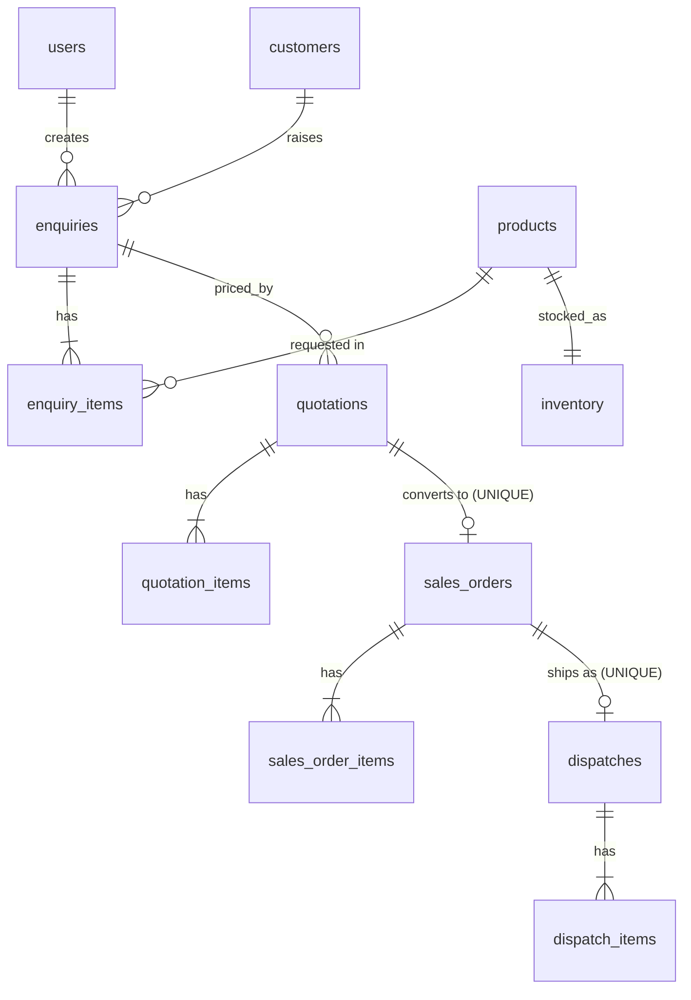

# Foundry ERP – Enquiry → Quotation → Sales Order → Reservation → Dispatch

**Stack:** PostgreSQL · Express · React (Vite) · Node.js · plain `pg` (SQL + explicit transactions) · JWT + bcrypt

## 1. Prerequisites
Node 18+, PostgreSQL 14+.

## 2. Database setup
```bash
psql -U postgres -c "CREATE DATABASE erp_db;"
psql -U postgres -c "CREATE DATABASE erp_test_db;"   # used only by automated tests (gets wiped)
```

## 3. Backend
```bash
cd backend
cp .env.example .env          # edit DATABASE_URL / JWT_SECRET
npm install
npm run db:reset              # creates all tables + seeds users and 7 products
npm run dev                   # http://localhost:4000
```
| Variable | Meaning |
|---|---|
| `PORT` | API port (4000) |
| `DATABASE_URL` | main database |
| `TEST_DATABASE_URL` | separate DB for tests |
| `JWT_SECRET` | long random string |
| `CLIENT_ORIGIN` | allowed CORS origin |

## 4. Frontend
```bash
cd frontend && npm install && npm run dev     # http://localhost:5173 (proxies /api → :4000)
```

## 5. Tests
```bash
cd backend && npm test
```
Covers: quotation maths, draft/rejected conversion blocked, duplicate order blocked, over-reservation blocked, RBAC (401/403), full reserve→dispatch flow, cancel releases stock, and **concurrent reservation (bonus)**.

## 6. Test logins
| Role | Email | Password |
|---|---|---|
| Admin | admin@erp.com | Admin@123 |
| Sales | sales@erp.com | Sales@123 |

Anyone can register from the login screen; public registration always creates a **SALES** user (never ADMIN).

## 7. Schema (ER diagram)

Full DDL: `backend/db/schema.sql`. Key integrity rules:
- `inventory`: `physical_qty >= 0`, `reserved_qty >= 0`, `reserved_qty <= physical_qty` (CHECKs). Available = physical − reserved, derived in queries.
- `sales_orders.quotation_id UNIQUE` → one quotation can only ever create one order.
- `dispatches.order_id UNIQUE` → an order can only be dispatched once.
- Document numbers (`ENQ-/QUO-/SO-/DSP-000001`) come from DB sequences.

## 8. Concurrency approach
`confirm`, `cancel` and `dispatch` run in one transaction: `SELECT … FOR UPDATE` on the order row, then on its `inventory` rows ordered by `product_id` (consistent lock order avoids deadlocks). Availability is checked *after* locking, so two simultaneous requests (80 and 50 against 100) serialise and the second fails with 409. The `reserved <= physical` CHECK is a last line of defence.

## 9. API (all under `/api`, JWT `Authorization: Bearer <token>`)
| Method | Path | Role |
|---|---|---|
| POST | `/auth/register`, `/auth/login` | public |
| GET | `/auth/me` | any |
| GET | `/products`, `/inventory` | any |
| PUT | `/inventory/:productId` `{physical_qty}` | ADMIN |
| GET / POST | `/enquiries` | any (view) / SALES (create) |
| GET / POST | `/quotations` | any (view) / SALES (create) |
| PATCH | `/quotations/:id/status` `{status}` | SALES (DRAFT→SENT→ACCEPTED/REJECTED) |
| POST | `/quotations/:id/convert` | SALES |
| GET | `/sales-orders` | any (view) |
| POST | `/sales-orders/:id/confirm` | ADMIN (reserves stock) |
| POST | `/sales-orders/:id/cancel` | ADMIN (releases reservation) |
| POST | `/sales-orders/:id/dispatch` `{vehicle_no, driver_name}` | ADMIN |

Sales users see only their own records; admins see everything. Totals are always recalculated server-side.

## 10. Still to do before you submit
- Demo video (≤5 min) and the Google Form.
- Postman collection (import the table above) or Swagger.
- Commit in small steps (schema → auth → enquiries → quotations → orders → tests → UI) so the history looks natural.
- Read through the code until you can explain every file: the live round asks you to add DAMAGED stock or order cancellation.
